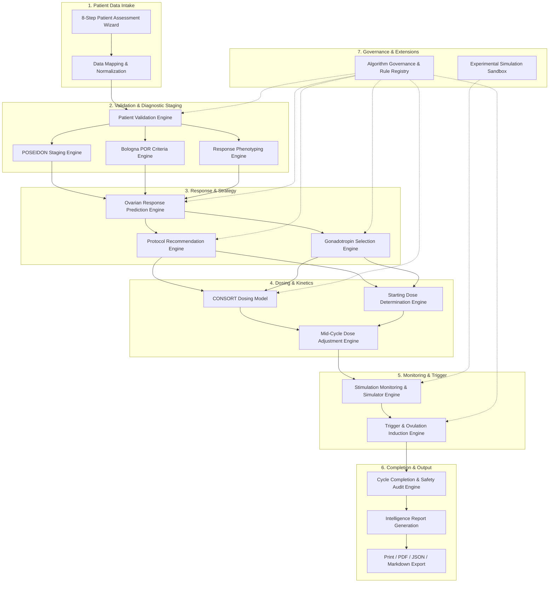

# AIFV
Automated ICS CDSS
# AIFV CDSS — Evidence-Based IVF & ICSI Clinical Decision Support System

[](https://tanstack.com/start)
[](https://www.typescriptlang.org/)
[](https://tailwindcss.com/)
[](https://vitejs.dev/)
[](#-evidence-library--master-registry)
[](LICENSE)

**AIFV CDSS** is a medical-grade, evidence-backed Clinical Decision Support System (CDSS) designed specifically for reproductive medicine specialists, IVF consultants, and embryology directors. The platform standardizes and optimizes individualized controlled ovarian stimulation (COS) planning, gonadotropin selection, dosing precision, mid-stimulation monitoring, trigger decision-making, and cycle outcome analysis using internationally validated clinical guidelines (ESHRE, ASRM, POSEIDON, Bologna Criteria) and predictive mathematical models.

---

## 📋 Table of Contents

- [📸 Architecture & Engine Pipeline](#-architecture--engine-pipeline)
- [🧬 Core Clinical Engines](#-core-clinical-engines)
- [📁 Project Folder Structure](#-project-folder-structure)
- [📦 System Prerequisites & Dependencies](#-system-prerequisites--dependencies)
- [🚀 Quick Start & Development Setup](#-quick-start--development-setup)
- [🛠️ Available NPM Scripts](#️-available-npm-scripts)
- [🧪 Automated Clinical Test Suite](#-automated-clinical-test-suite)
- [⚙️ Clinic Settings & Logo Customization](#️-clinic-settings--logo-customization)
- [📊 Intelligence Reports & Exports](#-intelligence-reports--exports)
- [📚 Evidence Library & Master Registry](#-evidence-library--master-registry)
- [🤝 Contributing & Git Workflow](#-contributing--git-workflow)
- [⚠️ Clinical Disclaimer](#️-clinical-disclaimer)

---

## 📸 Architecture & Engine Pipeline

The system is built around a deterministic multi-stage clinical intelligence engine pipeline. Every patient evaluation flows through a sequence of evidence-graded algorithms:



---

## 🧬 Core Clinical Engines

Located in [`ai-ivf-cdss/src/lib/engine/`](file:///c:/Users/raouf.RAOUFDESKTOP/Downloads/ivf/ai-ivf-cdss/src/lib/engine):

| Engine Module | File Source | Core Methodologies & Clinical Purpose |
| :--- | :--- | :--- |
| **Patient Validation** | [`types.ts`](file:///c:/Users/raouf.RAOUFDESKTOP/Downloads/ivf/ai-ivf-cdss/src/lib/engine/types.ts) | Validates input completeness, flags physiological anomalies, normalizes units. |
| **POSEIDON Classifier** | [`poseidon.ts`](file:///c:/Users/raouf.RAOUFDESKTOP/Downloads/ivf/ai-ivf-cdss/src/lib/engine/poseidon.ts) | Classifies patients into **POSEIDON Groups 1–4** (and subgroups 1a/1b/2a/2b) based on age, AFC, AMH, and prior oocyte yield. |
| **Bologna POR Criteria** | [`bologna.ts`](file:///c:/Users/raouf.RAOUFDESKTOP/Downloads/ivf/ai-ivf-cdss/src/lib/engine/bologna.ts) | Evaluates ESHRE Bologna criteria for Poor Ovarian Response (Age $\ge 40$, prior POR $\le 3$ oocytes, AFC $< 5-7$, AMH $< 0.5-1.1$ ng/mL). |
| **Response Phenotype** | [`phenotype.ts`](file:///c:/Users/raouf.RAOUFDESKTOP/Downloads/ivf/ai-ivf-cdss/src/lib/engine/phenotype.ts) | Determines reserve phenotype (Normal, Expected Poor, Expected High, Hypo-responder, Hyper-responder). |
| **Response Predictor** | [`ovarian-response.ts`](file:///c:/Users/raouf.RAOUFDESKTOP/Downloads/ivf/ai-ivf-cdss/src/lib/engine/ovarian-response.ts) | Predicts oocyte yield ranges (Low $\le 3$, Sub-optimal $4-9$, Optimal $10-15$, High $> 15$), OHSS risk, cancellation probability. |
| **Protocol Selection** | [`protocol-selection.ts`](file:///c:/Users/raouf.RAOUFDESKTOP/Downloads/ivf/ai-ivf-cdss/src/lib/engine/protocol-selection.ts) | Recommends optimal stimulation protocol (GnRH Antagonist, Long Agonist, Microdose Flare, DuoStim, Modified Natural). |
| **Gonadotropin Selection**| [`gonadotropin-selection.ts`](file:///c:/Users/raouf.RAOUFDESKTOP/Downloads/ivf/ai-ivf-cdss/src/lib/engine/gonadotropin-selection.ts) | Evaluates rFSH vs. uFSH and scores rLH / hp-hMG addition for LH deficit, POSEIDON hypo-responders, and AMA. |
| **Gonadotropin Evidence** | [`gonadotropin-evidence.ts`](file:///c:/Users/raouf.RAOUFDESKTOP/Downloads/ivf/ai-ivf-cdss/src/lib/engine/gonadotropin-evidence.ts) | Cross-references RCTs and ESHRE guidelines to justify drug selection and LH supplementation. |
| **CONSORT Nomogram** | [`consort-model.ts`](file:///c:/Users/raouf.RAOUFDESKTOP/Downloads/ivf/ai-ivf-cdss/src/lib/engine/consort-model.ts) | Nomogram calculation estimating baseline rFSH starting dose based on basal FSH, BMI, age, and AFC. |
| **Starting Dose Engine** | [`starting-dose.ts`](file:///c:/Users/raouf.RAOUFDESKTOP/Downloads/ivf/ai-ivf-cdss/src/lib/engine/starting-dose.ts) | Integrates AMH, AFC, BMI, and prior response to calculate daily starting gonadotropin dose ($150 - 450\text{ IU/day}$). |
| **Mid-Cycle Adjustment** | [`dose-adjustment.ts`](file:///c:/Users/raouf.RAOUFDESKTOP/Downloads/ivf/ai-ivf-cdss/src/lib/engine/dose-adjustment.ts) | Analyzes day 5–8 follicular cohort dynamics and Estradiol trajectories to adjust daily dosage. |
| **Stimulation Monitor** | [`monitoring.ts`](file:///c:/Users/raouf.RAOUFDESKTOP/Downloads/ivf/ai-ivf-cdss/src/lib/engine/monitoring.ts) | Tracks folliculometry ($<10\text{mm}$, $10-13\text{mm}$, $14-16\text{mm}$, $\ge 17\text{mm}$), endometrial thickness, and $E_2$/$P_4$ curves. |
| **Trigger Decision** | [`trigger.ts`](file:///c:/Users/raouf.RAOUFDESKTOP/Downloads/ivf/ai-ivf-cdss/src/lib/engine/trigger.ts) | Calculates trigger timing, agent (Dual Trigger, GnRH Agonist alone, hCG), and freeze-all segmentation strategy for OHSS prevention. |
| **Cycle Completion** | [`cycle-completion.ts`](file:///c:/Users/raouf.RAOUFDESKTOP/Downloads/ivf/ai-ivf-cdss/src/lib/engine/cycle-completion.ts) | Retrospective quality & safety audit comparing predicted vs. actual oocyte yields to refine future algorithms. |
| **Algorithm Governance** | [`algorithm-governance.ts`](file:///c:/Users/raouf.RAOUFDESKTOP/Downloads/ivf/ai-ivf-cdss/src/lib/engine/algorithm-governance.ts) | Manages clinical rule versions, rule activation states, evidence tiers (Gold, Silver, Bronze), and physician override logs. |

---

## 📁 Project Folder Structure

```text
ivf/
├── START-AIFV.bat                    # One-click Windows application launcher (root)
├── AIFV_LOCAL_STARTUP_GUIDE.md       # User & administrator guide
├── AIFV_SYSTEM_BACKUP.zip            # System backup archive
├── package.json                      # Workspace dependencies manifest
└── ai-ivf-cdss/                      # Core Web Application Subsystem
    ├── START-AIFV.bat                # Nested application launcher
    ├── package.json                  # Application dependencies
    ├── vite.config.ts                # Vite 8 & TanStack configuration
    ├── tsconfig.json                 # TypeScript strict compiler config
    ├── test_all_engines.ts           # 14-engine automated clinical test suite
    ├── public/                       # Static public assets & favicons
    └── src/
        ├── components/               # React UI Components
        │   ├── app-shell.tsx         # Main layout shell, sidebar & top navbar
        │   ├── brand-mark.tsx        # Dynamic brand logo & clinic title component
        │   ├── page-header.tsx       # Standardized page headers
        │   ├── patient-record-bar.tsx# Patient selector bar
        │   ├── assessment/           # 8-Step Assessment Wizard components
        │   ├── engine/               # Sub-panel components for clinical engines
        │   ├── report/               # Intelligence report view & export actions
        │   └── ui/                   # Radix UI / Shadcn base design system
        ├── hooks/
        │   ├── use-theme.ts          # Dark / Light theme toggle hook
        │   ├── use-clinic-settings.ts# Reactive clinic settings & logo sync hook
        │   └── use-mobile.tsx        # Mobile viewport breakpoint hook
        ├── lib/                      # Business & Clinical Logic
        │   ├── assessment/           # Patient schema, state, and validation
        │   ├── clinical/             # Data mapping & clinical datasets
        │   ├── engine/               # 15+ Clinical Calculation Engines
        │   ├── evidence/             # Evidence Library database & search engine
        │   └── report/               # Intelligence report generator
        └── routes/                   # TanStack Router File-Based Pages
            ├── __root.tsx            # Global HTML document root
            ├── index.tsx             # Landing / welcome view
            ├── _shell.tsx            # Authenticated layout wrapper
            ├── _shell.dashboard.tsx  # Main clinician dashboard
            ├── _shell.assessment.tsx # 8-Step Patient Assessment Wizard
            ├── _shell.decision-support.tsx # Phenotype Engine Dashboard
            ├── _shell.poseidon.tsx   # POSEIDON Classifier Tool
            ├── _shell.patients.tsx   # Patient directory & records
            ├── _shell.reports.tsx    # Intelligence report view & export
            ├── _shell.settings.tsx   # Clinic profile & logo configuration
            └── _shell.experimental-sandbox.tsx # Simulation Sandbox
```

---

## 📦 System Prerequisites & Dependencies

### Prerequisites
- **Node.js**: `v18.0.0+` (`v20.x` or `v24.x` recommended)
- **Package Manager**: `npm` (v9+) or `bun`

### Core Tech Stack

| Category | Package | Version |
| :--- | :--- | :--- |
| **Framework** | `react`, `react-dom` | `^19.2.0` |
| **Routing** | `@tanstack/react-router`, `@tanstack/react-start` | `^1.170.18` |
| **State & Query** | `@tanstack/react-query` | `^5.101.1` |
| **Styling** | `tailwindcss`, `@tailwindcss/vite` | `^4.2.1` |
| **UI Controls** | `@radix-ui/*` primitives, `lucide-react`, `sonner` | Various |
| **Charts & Viz** | `recharts` | `^2.15.4` |
| **Form & Validation**| `zod`, `react-hook-form`, `@hookform/resolvers` | Various |
| **Build & Compiler**| `vite`, `typescript`, `nitro` | `^8.2.0`, `^5.8.3` |

---

## 🚀 Quick Start & Development Setup

### Method A: Windows One-Click Launcher
Double-click **`START-AIFV.bat`** in the project root folder. The script checks your Node environment, verifies dependencies, starts the dev server, and automatically opens `http://localhost:8080`.

### Method B: Manual Command Line

1. **Clone the repository**:
   ```bash
   git clone <repository-url>
   cd ivf/ai-ivf-cdss
   ```

2. **Install dependencies**:
   ```bash
   npm install
   ```

3. **Start the development server**:
   ```bash
   npm run dev
   ```
   Open your browser at `http://localhost:8080` (or `http://localhost:5173`).

---

## 🛠️ Available NPM Scripts

Executed inside `ai-ivf-cdss/`:

| Script | Command | Description |
| :--- | :--- | :--- |
| **`npm run dev`** | `vite dev` | Starts local dev server with Hot Module Replacement (HMR) on port `8080`. |
| **`npm run build`** | `vite build` | Compiles production distribution bundle. |
| **`npm run build:dev`** | `vite build --mode development` | Compiles development-mode build artifact. |
| **`npm run preview`** | `vite preview` | Serves local preview of compiled production build. |
| **`npm run lint`** | `eslint .` | Runs ESLint analysis across all source files. |
| **`npm run format`** | `prettier --write .` | Formats all source code according to project style guide. |

---

## 🧪 Automated Clinical Test Suite

The repository includes a comprehensive 14-engine verification script that validates clinical calculations across all patient profiles:

```bash
npx tsx --tsconfig ai-ivf-cdss/tsconfig.json ai-ivf-cdss/test_all_engines.ts
```

The test runner evaluates:
- POSEIDON Groups 1–4 classification accuracy
- Bologna POR criteria matching
- CONSORT starting dose nomogram outputs
- Ovarian response predictions and OHSS risk stratification
- Trigger agent selection and freeze-all segmentation flags

---

## ⚙️ Clinic Settings & Logo Customization

Developers and administrators can configure workspace options on the **Settings page** (`/_shell/settings`):

- **Clinic Logo Upload**: Upload custom clinic logos (PNG, JPG, SVG, WebP up to 5MB). Images are stored as Data URLs and dynamically updated in the application header via [`useClinicSettings()`](file:///c:/Users/raouf.RAOUFDESKTOP/Downloads/ivf/ai-ivf-cdss/src/hooks/use-clinic-settings.ts).
- **Clinic Name & Country**: Customizes patient report headers and app branding.
- **Unit Preferences**: Toggle between SI units and Conventional laboratory units.
- **Dark Theme Toggle**: Switches workspace theme globally.

---

## 📊 Intelligence Reports & Exports

The Intelligence Report Engine ([`src/components/report/intelligence-report-view.tsx`](file:///c:/Users/raouf.RAOUFDESKTOP/Downloads/ivf/ai-ivf-cdss/src/components/report/intelligence-report-view.tsx)) provides multi-format data export options:

- 📄 **Export PDF**: Opens print preview with dedicated print stylesheet.
- 📝 **Download Markdown (`.md`)**: Structured clinical text output for EHR embedding.
- 📑 **Download Text (`.txt`)**: Plain text clinical summary.
- 📊 **Download JSON (`.json`)**: Machine-readable structured dataset.
- 📈 **Download CSV (`.csv`)**: Tabular laboratory and monitoring dataset.

---

## 📚 Evidence Library & Master Registry

Every clinical decision rule is linked to evidence cards indexed in [`src/lib/evidence/`](file:///c:/Users/raouf.RAOUFDESKTOP/Downloads/ivf/ai-ivf-cdss/src/lib/evidence):
- **Grade A**: Randomized Controlled Trials (RCTs) & Cochrane Meta-analyses.
- **Grade B**: Prospective cohort studies & ESHRE/ASRM guidelines.
- **Grade C**: Retrospective series & international consensus.
- **Grade D**: Expert opinion & validated clinical algorithms.

---

## 🤝 Contributing & Git Workflow

1. Fork or clone the repository.
2. Create a feature branch: `git checkout -b feature/clinical-engine-name`.
3. Verify type checks and run engine tests: `npx tsc --noEmit`.
4. Commit changes: `git commit -m "feat: Add mid-stimulation progesterone surge threshold"`.
5. Open a Pull Request for review.

---

## ⚠️ Clinical Disclaimer

*AIFV CDSS is designed solely as an evidence-based decision support system for licensed medical practitioners and reproductive endocrinologists. All recommendations generated by the system must be reviewed by a qualified physician in the context of the patient's individual clinical picture prior to therapeutic decisions.*

---

© 2026 AIFV Clinical Decision Support Systems. All rights reserved.
l picture prior to making therapeutic decisions._
